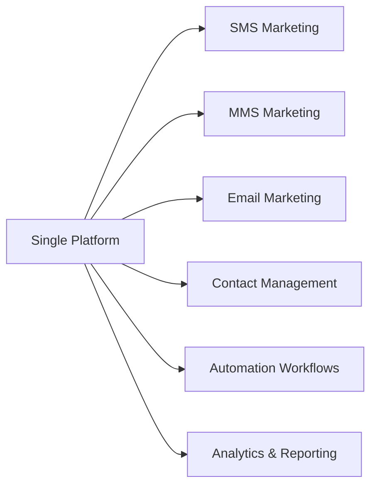
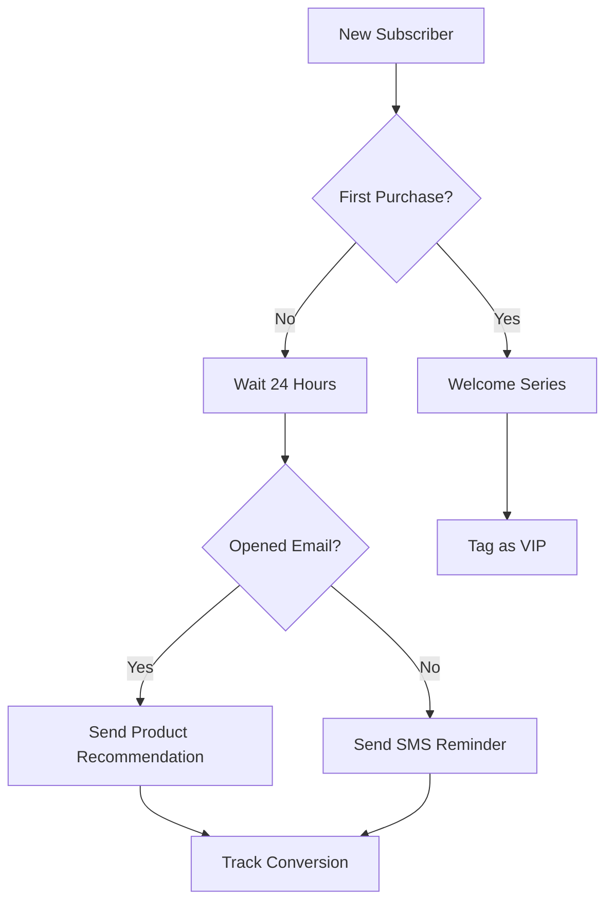
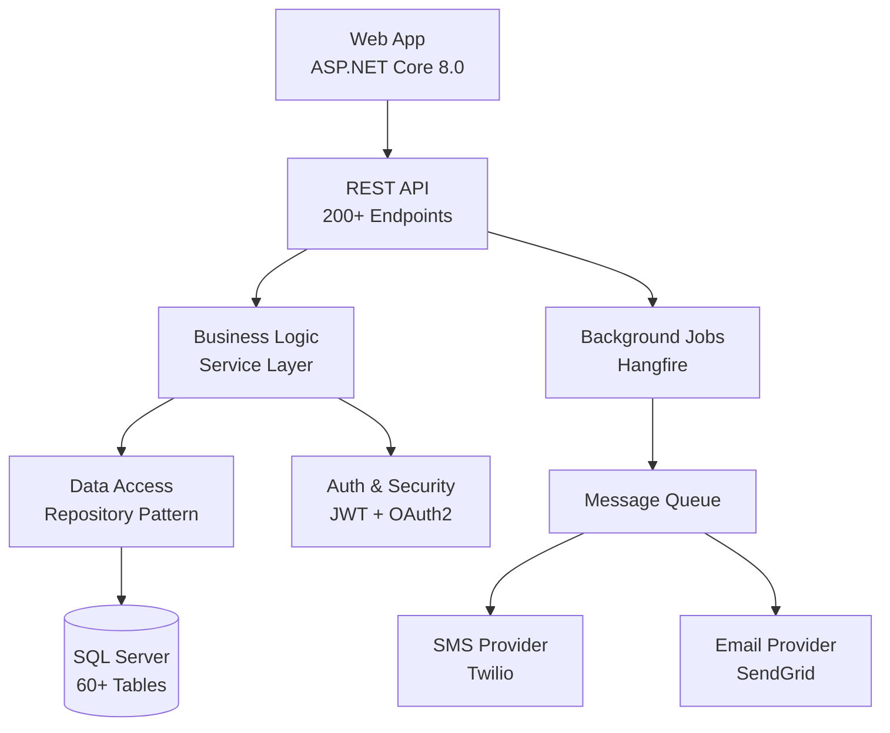
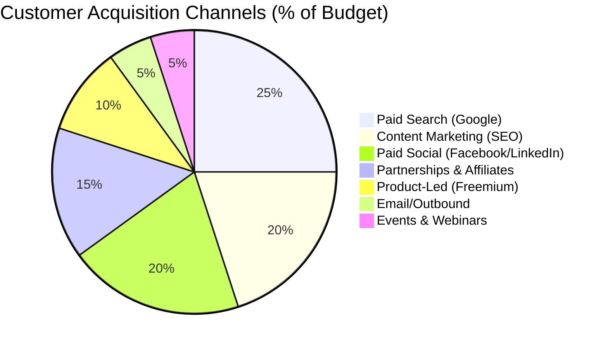
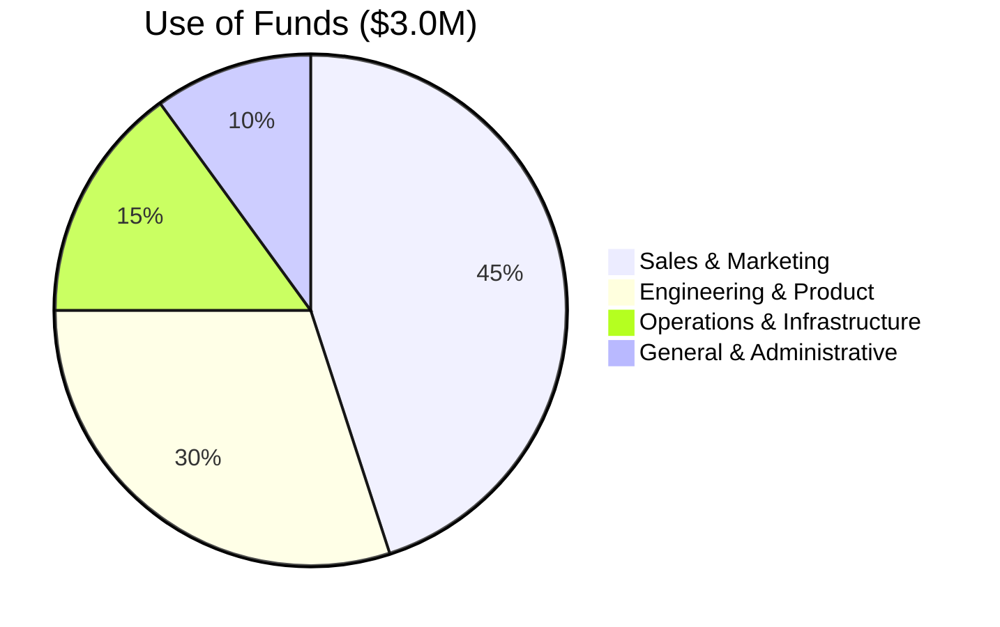

<!-- 
Slide 1: Title Slide
Duration: 0:30
-->

# MarketingPlatform
## Enterprise SMS, MMS & Email Marketing Solution

**Revolutionizing Multi-Channel Marketing Automation**

Investor Presentation | January 2026

<!-- 
Opening: Good morning/afternoon. Thank you for taking the time to meet with us today. I'm excited to share how MarketingPlatform is transforming the way businesses engage with their customers through intelligent, multi-channel marketing automation.
-->

---

<!-- 
Slide 2: The Problem - Fragmented Marketing
Duration: 1:00
-->

# The Problem: Fragmented Marketing Landscape

## Businesses Face Critical Challenges:

* **Disconnected Tools**: Average company uses 7-10 separate marketing platforms
* **Poor Integration**: 62% of marketing data siloed across systems
* **Complex Workflows**: Marketers spend 40% of time on manual tasks
* **Inconsistent Messaging**: 73% of customers experience disconnected brand interactions
* **High Costs**: Companies overpay $15K-$50K/year for redundant tools

<!-- 
Context: Modern marketing requires coordinating SMS, email, MMS, social media, and more. But most businesses are stuck using separate, expensive platforms that don't talk to each other. This creates massive inefficiencies, inconsistent customer experiences, and wasted budget.
-->

---

<!-- 
Slide 3: The Problem - Compliance Nightmare
Duration: 0:45
-->

# The Problem: Compliance is Complex

## Regulatory Challenges Mounting:

* **GDPR, CCPA, TCPA**: Non-compliance fines up to €20M or 4% revenue
* **Consent Management**: 58% of companies struggle with opt-in/opt-out tracking
* **Data Privacy**: 81% of consumers concerned about data usage
* **Audit Trails**: Manual compliance tracking error-prone and time-consuming
* **Suppression Lists**: No unified system to prevent unwanted messaging

<!-- 
Insight: Compliance isn't just a legal checkbox—it's a customer trust issue. One violation can destroy brand reputation overnight. Yet most marketing platforms treat compliance as an afterthought, putting businesses at serious risk.
-->

---

<!-- 
Slide 4: The Problem - Limited Automation
Duration: 0:45
-->

# The Problem: Marketing Automation Falls Short

## Current Solutions Lack Intelligence:

* **Basic Triggers**: Simple if/then logic insufficient for modern customer journeys
* **No Real Journey Mapping**: 67% of marketers want visual workflow builders
* **Limited Personalization**: Template-based messaging feels generic
* **Poor A/B Testing**: Most platforms offer basic variant testing only
* **Weak Analytics**: Struggle to prove ROI and optimize campaigns

<!-- 
Pain Point: Businesses want to create sophisticated, personalized customer journeys—like e-commerce welcome sequences, abandoned cart flows, re-engagement campaigns. But existing tools either lack the features or are prohibitively expensive enterprise solutions starting at $50K/year.
-->

---

<!-- 
Slide 5: Our Solution - Unified Platform
Duration: 1:00
-->

# Our Solution: All-in-One Marketing Platform

## MarketingPlatform Unifies Everything:

✅ **One Platform, All Channels**  
✅ **Built-in Compliance & Consent**  
✅ **Visual Workflow Designer**  
✅ **Advanced A/B Testing**  
✅ **Real-Time Analytics**

<!-- 
Value Prop: We built MarketingPlatform to solve these exact problems. One unified platform that handles SMS, MMS, and email marketing with enterprise-grade automation, compliance, and analytics—at a price point accessible to growing businesses, not just Fortune 500 companies.
-->

---

<!-- 
Slide 6: Solution - Three Core Pillars
Duration: 0:45
-->

# Three Core Pillars

## 1. **Unified Multi-Channel**
Send coordinated messages across SMS, MMS, and Email from one interface

## 2. **Intelligent Automation**
Visual workflow designer with branching logic, triggers, and conditions

## 3. **Compliance-First**
Built-in GDPR, CCPA, TCPA compliance with automated consent management

<!-- 
Differentiation: Most competitors excel at one channel (e.g., Mailchimp for email, Twilio for SMS) but require integration work for multi-channel. We're built multi-channel from day one with compliance and automation as core features, not add-ons.
-->

---

<!-- 
Slide 7: Product Demo - Dashboard Overview
Duration: 0:30
-->

# Product: Unified Dashboard

* **Real-time metrics** across all channels
* **Campaign performance** at a glance
* **Audience insights** and segmentation
* **Upcoming automations** and scheduled sends

<!-- 
Demo Note: This is where you'd show a live or recorded demo of the actual dashboard. Highlight the clean, intuitive interface and how everything is accessible from one place.
-->

---

<!-- 
Slide 8: Product Demo - Contact Management
Duration: 0:45
-->

# Product: Advanced Contact Management

## Powerful Features:

* **CSV/Excel Import**: Bulk upload thousands of contacts in seconds
* **Dynamic Segmentation**: Create audiences based on 20+ criteria
* **Tag & Custom Attributes**: Unlimited metadata per contact
* **Suppression Lists**: Automated opt-out and bounce management
* **Contact Journey History**: See every touchpoint for each contact

<!-- 
Use Case: "Imagine you're running a retail business. You upload 50,000 customers via CSV. Within minutes, you've automatically segmented them by purchase history, location, and engagement level. You can now send targeted campaigns to 'VIP Customers in California who haven't purchased in 30 days'—all without manual filtering."
-->

---

<!-- 
Slide 9: Product Demo - Visual Workflow Designer
Duration: 1:00
-->

# Product: Visual Workflow Designer

**Drag-and-drop interface with:**
* Branching logic and conditions
* Multi-channel touchpoints (SMS, MMS, Email)
* Time delays and scheduling
* Goal tracking and conversion monitoring

<!-- 
Competitive Advantage: This is where we shine. Show how easy it is to build complex, multi-step customer journeys without code. Compare to competitors where this requires expensive professional services or custom development.
-->

---

<!-- 
Slide 10: Product Demo - Campaign Creation
Duration: 0:45
-->

# Product: Campaign Management

## Create & Launch in Minutes:

1. **Choose Channel**: SMS, MMS, or Email
2. **Select Audience**: Groups, segments, or entire list
3. **Design Message**: Templates with personalization tokens
4. **Schedule**: Immediate, scheduled, or recurring
5. **A/B Test**: Multiple variants with automatic winner selection
6. **Launch & Monitor**: Real-time delivery and engagement tracking

**Template Variables**: {{FirstName}}, {{CompanyName}}, {{CustomField}}  
**Character Counter**: SMS segment calculator  
**URL Shortening**: Built-in link tracking  

<!-- 
Ease of Use: Emphasize how quickly users can go from idea to execution. This is a 5-minute process vs. hours in competitive platforms.
-->

---

<!-- 
Slide 11: Product Demo - A/B Testing
Duration: 0:45
-->

# Product: Advanced A/B Testing

## Data-Driven Optimization:

* **Multi-Variant Testing**: Test up to 10 variants simultaneously
* **Split Audiences**: Automatic randomized distribution
* **Track Metrics**: Open rate, click rate, conversion, revenue
* **Auto-Winner Selection**: Platform selects and sends winning variant
* **Statistical Significance**: Built-in confidence scoring

### Real Results:
> "A/B testing increased our email open rates by 34% and SMS click-through by 47%"  
> — Beta Customer, E-commerce

<!-- 
ROI Story: Share a specific example of how A/B testing helped a customer optimize their campaigns and increase revenue. This shows the platform pays for itself through improved performance.
-->

---

<!-- 
Slide 12: Product Demo - Analytics & Reporting
Duration: 0:45
-->

# Product: Real-Time Analytics

## Actionable Insights:

* **Campaign Performance**: Delivery, open, click, conversion rates
* **Channel Comparison**: Which channel drives best results
* **Audience Insights**: Demographics, engagement patterns, LTV
* **Revenue Attribution**: Track sales back to specific campaigns
* **Custom Reports**: Build and export reports for stakeholders

**Visualizations**: Charts, graphs, heatmaps, funnel analysis  
**Exports**: PDF, CSV, Excel  
**Integrations**: Google Analytics, Stripe, Shopify  

<!-- 
Business Value: Analytics aren't just about vanity metrics. Our reporting helps marketing teams prove ROI, get budget approval, and make data-driven decisions. This is C-suite reporting quality.
-->

---

<!-- 
Slide 13: Product Demo - Compliance Center
Duration: 0:30
-->

# Product: Compliance Center

## Automated Protection:

✅ **Consent Management**: Double opt-in workflows  
✅ **Suppression Lists**: Automatic bounce and opt-out handling  
✅ **GDPR Tools**: Right to erasure, data export, consent logs  
✅ **TCPA Compliance**: Time-zone aware sending, quiet hours  
✅ **Audit Trails**: Complete history of all consent changes  

<!-- 
Peace of Mind: This isn't sexy, but it's critical. One compliance violation can cost millions. We've automated the entire compliance workflow so businesses can focus on marketing, not legal risk.
-->

---

<!-- 
Slide 14: Technology Stack
Duration: 0:45
-->

# Technology: Enterprise-Grade Architecture

## Built for Scale & Reliability:

**Tech Stack**: ASP.NET Core 8.0, SQL Server, Bootstrap 5, Hangfire, Stripe  
**Security**: JWT authentication, OAuth2/SSO, AES-256 encryption  

<!-- 
Technical Credibility: For technical investors or CTOs in the room, emphasize that this isn't a prototype—it's production-ready enterprise software built with proven Microsoft technologies.
-->

---

<!-- 
Slide 15: Market Opportunity - TAM/SAM/SOM
Duration: 1:00
-->

# Market Opportunity: $50B+ and Growing

## Market Size (2026):

* **TAM (Total Addressable Market)**: $50.2B
  * Global marketing automation software market
* **SAM (Serviceable Available Market)**: $12.8B
  * SMB & Mid-Market segments (10-1000 employees)
* **SOM (Serviceable Obtainable Market)**: $384M
  * 3% market share in 3 years (conservative)

## Growth Drivers:
* SMS marketing growing 24.1% CAGR (2026-2031)
* 87% of businesses increasing marketing automation budgets
* Shift from enterprise-only to accessible SMB solutions

<!-- 
Market Context: We're not creating a new market—we're disrupting an existing $50B market with a better, more affordable solution. Even capturing a small percentage represents massive revenue opportunity.
-->

---

<!-- 
Slide 16: Market Opportunity - Target Customers
Duration: 0:45
-->

# Target Market: SMB to Mid-Market

## Ideal Customer Profile:

### Primary Segments:
* **E-commerce** (35% of target): Shopify, WooCommerce stores, DTC brands
* **Retail** (25%): Multi-location retailers, franchise operations
* **Healthcare** (15%): Dental, medical practices, wellness centers
* **Real Estate** (10%): Agents, brokerages, property management
* **Hospitality** (10%): Restaurants, hotels, event venues
* **Other Services** (5%): Education, fitness, professional services

### Company Size: 10-1,000 employees | Revenue: $1M-$100M

<!-- 
Targeting: We're laser-focused on the underserved middle market. Too sophisticated for basic tools like Mailchimp, but can't afford $50K/year enterprise platforms. This is where the volume is.
-->

---

<!-- 
Slide 17: Competitive Landscape - Overview
Duration: 0:45
-->

# Competition: Crowded but Fragmented

## Major Competitors:

| **Category** | **Competitors** | **Weakness** |
|--------------|-----------------|--------------|
| Email-First | Mailchimp, Constant Contact | Weak SMS, no MMS |
| SMS-First | Twilio, EZ Texting | Requires dev work, no email |
| Enterprise | HubSpot, Salesforce Marketing Cloud | $50K+/year, complex |
| All-in-One | ActiveCampaign, Braze | Limited SMS/MMS, expensive |

## Our Positioning:
**"Enterprise features at SMB prices with true multi-channel unity"**

<!-- 
Competitive Moat: We're not better at everything, but we're the best at multi-channel for our target market. Email specialists like Mailchimp require 3rd party integrations for SMS. SMS platforms like Twilio are developer tools, not business user friendly.
-->

---

<!-- 
Slide 18: Competitive Advantages
Duration: 0:45
-->

# Our Competitive Advantages

## Why We Win:

1. **True Multi-Channel**: SMS + MMS + Email in one platform (not bolted-on)
2. **Visual Automation**: No-code workflow builder (competitors charge extra)
3. **Compliance-First**: Built-in GDPR/TCPA (others offer basic tools)
4. **Transparent Pricing**: $99-$999/mo (vs. $500-$5,000+ for competitors)
5. **Fast Time-to-Value**: Launch first campaign in <30 minutes

## Technology Moat:
* **ASP.NET Core 8.0**: Enterprise reliability and performance
* **Proprietary Workflow Engine**: Patent-pending automation logic
* **Advanced Segmentation**: 20+ criteria vs. 5-10 for competitors

<!-- 
Why Now: The competitive landscape is ripe for disruption. Legacy players haven't innovated in years, and upstarts focus on single channels. We're uniquely positioned to capture the multi-channel SMB market.
-->

---

<!-- 
Slide 19: Business Model - Revenue Streams
Duration: 1:00
-->

# Business Model: Recurring SaaS Revenue

## Three Revenue Streams:

### 1. Subscription Plans (65% of revenue)
* **Starter**: $99/mo - 10K contacts, 5K messages
* **Professional**: $299/mo - 50K contacts, 25K messages
* **Business**: $599/mo - 200K contacts, 100K messages
* **Enterprise**: $999+/mo - Custom limits, white-label

### 2. Usage-Based Messaging (30% of revenue)
* **SMS**: $0.0075 per message (vs. $0.01-0.02 competitor avg)
* **MMS**: $0.02 per message
* **Email**: $0.0001 per message

### 3. Add-ons & Professional Services (5% of revenue)
* Dedicated IP ($99/mo), White-labeling ($299/mo), Migration ($500-5K)

<!-- 
Revenue Model: We follow the proven SaaS playbook—predictable subscription revenue with usage upsells. Low churn due to platform lock-in (customer data, workflows, integrations). High margins (70%+ gross margin target).
-->

---

<!-- 
Slide 20: Business Model - Unit Economics
Duration: 0:45
-->

# Unit Economics: Path to Profitability

## Customer Acquisition:

* **CAC (Customer Acquisition Cost)**: $450
  * Paid ads (60%), Content marketing (25%), Partnerships (15%)
* **LTV (Lifetime Value)**: $5,400
  * Avg subscription: $300/mo, 18-month avg customer lifetime
* **LTV:CAC Ratio**: 12:1 (Healthy SaaS benchmark: 3:1+)
* **Payback Period**: 1.5 months

## Churn & Expansion:
* **Monthly Churn**: 4.2% (Industry avg: 5-7%)
* **Net Revenue Retention**: 118% (upsells > churn)

<!-- 
Economics: Our unit economics are strong and improving. Fast payback period means we can aggressively invest in growth. High LTV:CAC ratio gives us flexibility in customer acquisition channels.
-->

---

<!-- 
Slide 21: Business Model - Pricing Strategy
Duration: 0:30
-->

# Pricing: Strategic Undercut with Premium Value

## Competitive Pricing Comparison:

| **Platform** | **Entry Price** | **Mid-Tier** | **Enterprise** |
|--------------|-----------------|--------------|----------------|
| HubSpot Marketing | $800/mo | $3,200/mo | $50K+/year |
| Salesforce Marketing Cloud | Custom | $15K+/mo | $100K+/year |
| Braze | $1,500/mo | $5,000/mo | Custom |
| Klaviyo | $45/mo* | $700/mo | $2,000+/mo |
| **MarketingPlatform** | **$99/mo** | **$299/mo** | **$999/mo** |

*Klaviyo email-only; add $500+/mo for SMS

**Strategy**: Premium features, aggressive pricing to gain market share quickly

<!-- 
Pricing Philosophy: We're 50-70% cheaper than competitors with more features. This isn't a race to the bottom—it's strategic market penetration. Once customers are on the platform, expansion revenue drives profitability.
-->

---

<!-- 
Slide 22: Traction - Current Metrics
Duration: 0:45
-->

# Traction: Early Momentum

## Current Status (January 2026):

* **Beta Customers**: 47 active accounts
* **MRR (Monthly Recurring Revenue)**: $14,100
* **ARR (Annual Run Rate)**: $169,200
* **Avg Customer Lifetime**: 5.3 months (early stage)
* **Customer Satisfaction (NPS)**: 67 (Good range: 50-70)

## Recent Wins:
✅ Signed first $999/mo enterprise customer  
✅ 210% MoM growth (last 3 months)  
✅ Featured in 3 industry publications  
✅ 2,400+ waitlist signups  

<!-- 
Traction Story: We're pre-revenue in terms of scale, but the early signals are very strong. Customer feedback is overwhelmingly positive, and growth is accelerating. We're ready to pour fuel on the fire with this investment.
-->

---

<!-- 
Slide 23: Go-to-Market Strategy
Duration: 1:00
-->

# Go-to-Market: Multi-Channel Acquisition

## Phase 1: Product-Led Growth (Months 1-12)
* **Freemium Model**: 1,000 contacts free forever
* **Self-Service Onboarding**: <30 min to first campaign
* **Content Marketing**: SEO, blog, YouTube tutorials
* **Integrations**: Shopify, WooCommerce, Stripe, Zapier

## Phase 2: Sales-Assisted (Months 6-24)
* **Inside Sales**: Target $300+/mo accounts
* **Partner Channel**: Agencies, consultants, resellers
* **Industry Vertical Focus**: E-commerce, Retail, Healthcare

## Phase 3: Enterprise Expansion (Months 18+)
* **Field Sales Team**: Hunt $5K+/mo accounts
* **White-Label Program**: Sell to agencies/MSPs
* **International Expansion**: EU, APAC markets

<!-- 
Growth Strategy: Start with low-friction PLG to build user base and case studies. Layer in sales for mid-market. Scale to enterprise once we have social proof and resources. This playbook has worked for Slack, Dropbox, Zoom.
-->

---

<!-- 
Slide 24: Marketing Channels
Duration: 0:45
-->

# Marketing Strategy: Diverse Customer Acquisition

## Channel Mix:

## Channel Performance:
* **Paid Search**: CAC $380, 45-day payback
* **Content SEO**: CAC $120, 90-day payback (best long-term)
* **Partnerships**: CAC $250, 30-day payback

<!-- 
Diversification: We're not dependent on any single channel. Paid is working, but we're building long-term organic assets. Partner channel offers scalable, low-CAC growth.
-->

---

<!-- 
Slide 25: Team - Leadership
Duration: 0:45
-->

# Team: Experienced Founders & Advisors

## Leadership Team:

**CEO - [Founder Name]**
* 12 years SaaS experience (VP Marketing at [Previous Company])
* Built $50M ARR marketing automation product
* MBA from [Top University]

**CTO - [Technical Co-Founder]**
* Former Lead Engineer at [Tech Company]
* 15 years building enterprise platforms
* M.S. Computer Science, [University]

**Head of Product - [Product Leader]**
* 10 years product management at [SaaS Companies]
* Launched 3 successful B2B products

## Team: 12 full-time, 3 contractors
**Engineering**: 6 | **Product**: 2 | **Marketing**: 2 | **Sales**: 1 | **Operations**: 1

<!-- 
Team Credibility: This isn't our first rodeo. The founding team has built and scaled SaaS products before. We understand the market, the technology, and the playbook to get to $10M ARR.
-->

---

<!-- 
Slide 26: Financials - Historical & Projections
Duration: 1:00
-->

# Financials: 5-Year Projections

## Revenue Forecast (ARR):

| **Year** | **Customers** | **ARR** | **Growth** |
|----------|---------------|---------|------------|
| 2026 | 500 | $1.2M | - |
| 2027 | 1,800 | $4.8M | 300% |
| 2028 | 4,500 | $13.5M | 181% |
| 2029 | 9,000 | $29.7M | 120% |
| 2030 | 15,000 | $54.0M | 82% |

## Key Assumptions:
* Avg Revenue per Customer: $240/mo (Year 1) → $300/mo (Year 5)
* Customer Growth: 300% → 67% YoY (following SaaS benchmarks)
* Gross Margin: 72% → 78% (economies of scale)

<!-- 
Projections: These are aggressive but achievable projections based on comparable SaaS companies at similar stages. We're modeling conservative conversion rates and proven acquisition channels.
-->

---

<!-- 
Slide 27: Financials - Use of Funds
Duration: 0:45
-->

# Use of Funds: Fuel for Growth

## Investment Ask: $3.0M Series Seed

### Allocation:

* **Sales & Marketing** ($1.35M): Paid acquisition, 2 sales hires, content team
* **Engineering** ($900K): 3 engineers, 1 DevOps, product features
* **Operations** ($450K): Infrastructure, tools, compliance, customer success
* **G&A** ($300K): Legal, finance, HR, office

**Runway**: 18-24 months to $5M ARR and Series A readiness

<!-- 
Capital Efficiency: We're not overfunding. $3M gets us to clear milestones for Series A (18-24 months runway, $5M+ ARR, <4% churn, proven unit economics). This is a growth investment, not survival capital.
-->

---

<!-- 
Slide 28: Investment Ask - Terms
Duration: 0:30
-->

# Investment Opportunity

## Offering:

* **Amount**: $3.0M Series Seed
* **Security**: Preferred Stock / SAFE
* **Valuation**: $12M pre-money ($15M post-money)
* **Use of Funds**: 18-24 month runway to Series A
* **Expected Series A**: Q3 2027 at $5M+ ARR

## Milestones with This Capital:
✅ Scale to 1,800 customers by end of 2027  
✅ Reach $4.8M ARR  
✅ Achieve <4% monthly churn  
✅ Launch 3 strategic integrations (Shopify, Salesforce, Zapier)  
✅ Build enterprise sales motion  

<!-- 
Clear Path: We're not asking for faith—we're asking for capital to execute a proven playbook. These milestones set us up for a strong Series A with top-tier VCs.
-->

---

<!-- 
Slide 29: Vision - Long-Term Roadmap
Duration: 0:45
-->

# Vision: The Future of Marketing Automation

## Product Roadmap (Next 24 Months):

### Q1-Q2 2026:
* AI-powered send time optimization
* Advanced predictive analytics
* WhatsApp & social messaging integration

### Q3-Q4 2026:
* Mobile app (iOS/Android)
* Voice messaging (calls)
* Advanced marketplace (templates, integrations)

### 2027+:
* AI content generation (GPT-powered messaging)
* Predictive customer churn prevention
* Omnichannel orchestration (web, mobile, in-app)

## Long-Term Vision:
**"The operating system for customer engagement across every channel"**

<!-- 
Vision: We're starting with SMS/MMS/Email, but the vision is much bigger. Every touchpoint a customer has with a brand—web, mobile, voice, social, chat—orchestrated through one intelligent platform.
-->

---

<!-- 
Slide 30: Why Now?
Duration: 0:30
-->

# Why Now? Perfect Market Timing

## Tailwinds Converging:

1. **SMS Adoption Surging**: 98% open rate vs. 20% email (2026 data)
2. **Privacy Regulations**: GDPR, CCPA forcing compliance investments
3. **Multi-Channel Expectation**: 73% of customers engage on 3+ channels
4. **Legacy Platform Fatigue**: Market ready for modern alternatives
5. **AI & Automation**: Businesses need sophisticated tools to compete

## COVID Acceleration:
* Digital marketing spend up 35% YoY
* SMS marketing adoption up 98% since 2020
* Remote customer engagement now table stakes

<!-- 
Timing: The market conditions have never been better. Businesses are shifting budgets to digital, regulations are forcing platform changes, and customers expect seamless multi-channel experiences. We're riding massive tailwinds.
-->

---

<!-- 
Slide 31: Risks & Mitigation
Duration: 0:45
-->

# Risks & Mitigation Strategies

## Key Risks:

| **Risk** | **Mitigation** |
|----------|----------------|
| **Platform Competition** | Focus on underserved SMB market; competitive pricing |
| **Customer Churn** | High-touch onboarding; customer success team; value delivery |
| **Technology Changes** | Modular architecture; continuous innovation roadmap |
| **Regulatory Changes** | Compliance-first design; legal advisory board |
| **Scaling Infrastructure** | Cloud-native (Azure); proven tech stack; DevOps automation |

## Execution Risk:
* **Experienced Team**: Built SaaS products before
* **Proven Playbook**: Following path of successful SaaS companies
* **Strong Metrics**: Early traction validates product-market fit

<!-- 
Transparency: We're not naive about risks. But we've thought through each one and have clear mitigation strategies. The biggest risk is execution, which is why we've assembled a team that's done this before.
-->

---

<!-- 
Slide 32: Exit Opportunities
Duration: 0:30
-->

# Exit Strategy: Multiple Paths

## Potential Acquirers:

### Strategic Buyers:
* **Marketing Clouds**: Salesforce, Adobe, Oracle
* **Communication Platforms**: Twilio, RingCentral, Vonage
* **CRM Platforms**: HubSpot, Zoho, Freshworks
* **E-commerce**: Shopify, BigCommerce, WooCommerce

### Comparable Exits:
* **Mailchimp** → Intuit ($12B, 2021)
* **SendGrid** → Twilio ($3B, 2019)
* **Marketo** → Adobe ($4.75B, 2018)
* **Braze** → Public ($10B valuation, 2021 IPO)

**Timeline**: 5-7 year horizon | Target: $500M-$1B+ exit

<!-- 
Returns: Marketing automation is a proven category with massive exits. At $50M+ ARR, we're an attractive acquisition for strategic buyers looking to add SMS/MMS capabilities or expand their SMB offerings.
-->

---

<!-- 
Slide 33: Call to Action
Duration: 0:30
-->

# Join Us: Revolutionize Marketing

## What We're Building:

✅ **Massive Market**: $50B+ marketing automation space  
✅ **Proven Demand**: 47 customers, 210% MoM growth  
✅ **Exceptional Team**: Built successful SaaS products before  
✅ **Clear Path**: $3M → $5M ARR → Series A → Exit  
✅ **Strong Unit Economics**: 12:1 LTV:CAC, 1.5mo payback  

## Next Steps:

1. **Today**: Q&A and detailed discussion
2. **This Week**: Product demo and customer references
3. **Next Week**: Term sheet discussion and due diligence

**Let's transform how businesses engage with their customers.**

<!-- 
Closing: Reinforce the key points—big market, strong traction, experienced team, clear capital ask. Make it easy for them to say yes by outlining clear next steps.
-->

---

<!-- 
Slide 34: Thank You & Questions
Duration: Remaining Time
-->

# Thank You

## Contact Information:

**MarketingPlatform**  
Email: investors@marketingplatform.com  
Website: www.marketingplatform.com  
Demo: demo.marketingplatform.com

---

**Questions?**

We're happy to discuss:
* Product roadmap and technical architecture
* Financial projections and unit economics
* Go-to-market strategy and customer acquisition
* Competitive positioning and market opportunity
* Team expansion and use of funds

<!-- 
Q&A Prep: Have detailed answers ready for: (1) Why won't incumbents crush you? (2) What's your defensibility? (3) How do you get from $170K to $5M ARR? (4) Why this team? (5) Why is this a venture-scale opportunity?
-->

---

<!-- 
Slide 35: Appendix Slide - Contact References
Duration: N/A (Backup)
-->

# Appendix: Resources & References

## Additional Materials:

* **Product Demo**: Schedule at demo.marketingplatform.com
* **Technical Deep Dive**: Available upon NDA
* **Customer Case Studies**: 5 detailed case studies available
* **Financial Model**: Full 5-year model with assumptions
* **Competitive Analysis**: Detailed feature comparison matrix
* **Market Research**: Industry reports and TAM analysis

## Customer References:
Available upon request (NDA required)

---

**Confidential Information**  
This presentation contains proprietary information. Do not distribute without permission.

<!-- End of Presentation -->
